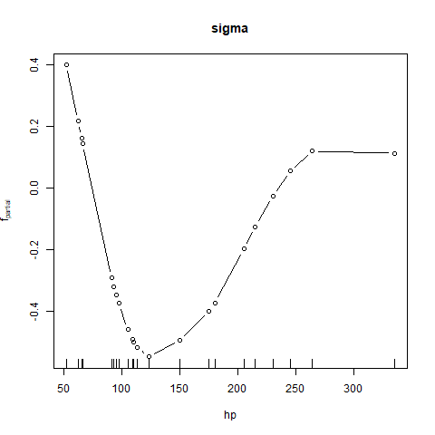

# gamboostLSS Project

## 📌 Project Overview

This project demonstrates the use of **gradient boosting for distributional regression** using the **gamboostLSS** framework in R.

Unlike traditional regression models that only estimate the mean, **gamboostLSS** allows modeling of multiple distribution parameters such as:

* **Location (mean, μ)**
* **Scale (variance, σ)**
* **Shape parameters**

This makes it especially useful for complex real-world datasets where variability and distributional characteristics change with predictors.

---

## 🎯 Objectives

* Understand and implement distributional regression using gamboostLSS
* Apply boosting techniques for variable selection
* Evaluate model performance using cross-validation
* Visualize model behavior and results

---

## ✅ Tasks Completed

### 🔹 Easy Task

* Dataset: `mtcars`
* Objective: Predict **mpg (miles per gallon)** using:

  * `wt` (weight)
  * `hp` (horsepower)

#### ✔ Method:

* Fitted a **GaussianLSS model**
* Performed **cross-validation** to determine optimal boosting iterations

#### 📊 Results:

* Optimal boosting iterations:

  * μ (mean) = 100
  * σ (variance) = 60
* Model coefficients extracted for both parameters

#### 📈 Visualization:

* Cross-validation risk vs boosting iterations
* Demonstrates convergence and optimal stopping point


This plot shows the cross-validation risk across boosting iterations.
The optimal stopping point corresponds to the minimum risk.

---

### 🔹 Hard Task

#### 📊 Data Simulation:

* Generated dataset with:

  * 500 observations
  * 20 predictor variables
* Only first **7 variables were informative**, rest were noise

#### ⚙️ Model Design:

* Two response variables: **Y1 and Y2**
* Each had:

  * Different mean (μ) functions
  * Different variance (σ) functions
* Dependency introduced using a **Gaussian copula**

#### 🧠 Model Fitting:

* Separate **GaussianLSS models** fitted for Y1 and Y2
* Applied **10-fold cross-validation** to determine optimal stopping

#### 📊 Results:

* **Y1 important variables:** X1, X2, X5
* **Y2 important variables:** X3, X4, X6
* Noise variables (X8–X20) were mostly ignored

#### 📈 Visualizations:

* Cross-validation plots
* Sigma (variance) behavior plots
* Demonstrates how variance changes with predictors



This plot illustrates how the variance (sigma) changes with predictors,
highlighting the model’s ability to capture heteroscedasticity.

---

## 🧠 Interpretation of Results

The model successfully captures both the mean (μ) and variance (σ) of the response variables.

- Variables X1–X6 were correctly identified as important predictors, showing the effectiveness of boosting for variable selection.
- Noise variables were largely ignored, demonstrating robustness in high-dimensional settings.
- The sigma plots indicate heteroscedasticity, meaning the variance changes with predictors rather than remaining constant.

This highlights the advantage of distributional regression over traditional regression models.

---

## 💡 Why This Matters

Traditional regression models only estimate the mean of the response variable. However, in many real-world problems, the variability also depends on predictors.

The gamboostLSS framework allows modeling of the full distribution, making it useful in:
- Finance (risk modeling)
- Healthcare (uncertainty in predictions)
- Environmental studies (variable conditions)

---

## 🧪 Key Insights

* The model successfully identified **true underlying variables**
* Demonstrated strong **variable selection capability**
* Effectively handled **high-dimensional data with noise**
* Showed the advantage of modeling **both mean and variance**

---

## ▶️ How to Run

1. Install required packages:

```r
install.packages("gamboostLSS")
```

2. Run scripts:

```r
source("scripts/easy_task.R")
source("scripts/hard_task.R")
```

---

## 📁 Project Structure

```
gamboostLSS-project/
│
├── scripts/
│   ├── easy_task.R
│   ├── hard_task.R
│
├── plots/
│   ├── easy_plot.png
│   ├── hard_plot.png
│
├── README.md
```

---

## 🔗 Repository Contents

* Easy Task R Script
* Hard Task R Script
* Visualizations and outputs

---

## 🚀 Future Improvements

* Extend to other distributions beyond GaussianLSS
* Apply model to real-world datasets
* Improve visualization and interpretability
* Explore hyperparameter tuning strategies

---

## 🙌 Acknowledgment

* This project was completed as part of preparation for **Google Summer of Code (GSoC)**, demonstrating understanding of distributional regression and boosting techniques.
